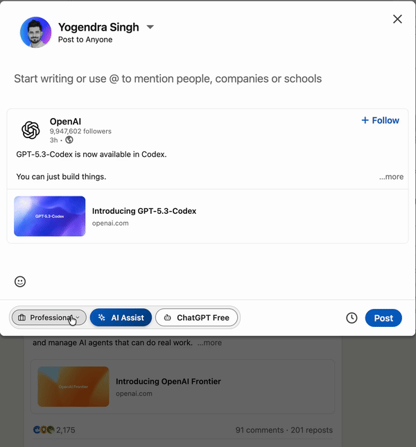

# LinkedIn AI Repost - Documentation

This repository contains public documentation and legal information for the **LinkedIn AI Repost with ChatGPT & Gemini** Chrome Extension.

## 🎬 Demo

See the extension in action:

  
  
<em>LinkedIn AI Repost extension creating engaging content</em>

## 📄 Legal Documents

- **[Privacy Policy](PRIVACY_POLICY.md)** - How we handle your data (spoiler: we don't collect any)
- **[Terms of Service](TERMS_OF_SERVICE.md)** - Terms and conditions for using the extension

## 🔗 Quick Links

- **Developer**: [Yogendra Singh](https://yogendrasingh.in)
- **Chrome Web Store**: [Link will be added after publishing]

## 📋 About the Extension

LinkedIn AI Repost with ChatGPT & Gemini is a privacy-first Chrome extension that helps you create engaging LinkedIn content using AI. It supports:

- **Repost Mode**: Generate commentary when sharing someone else's post
- **New Post Mode**: Rephrase and enhance your own draft content
- **Multiple AI Providers**: Google Gemini and OpenAI GPT with your own API keys
- **Free Tier Option**: Use ChatGPT, Claude, or Gemini web interfaces without API keys

### Key Features

- ✅ **Privacy-First**: Your API keys stay in your browser
- ✅ **BYOK Model**: Bring Your Own Key - you control costs
- ✅ **No Data Collection**: Direct browser-to-AI communication
- ✅ **Free Tier Available**: Use web-based AI platforms at no cost

## 🛡️ Privacy & Security

We take your privacy seriously:

- **No data collection** - We don't collect, store, or transmit any personal data
- **Local storage only** - API keys stored in Chrome's encrypted storage
- **Direct API calls** - Your browser communicates directly with AI providers
- **No tracking** - No analytics, telemetry, or usage monitoring

Read our full [Privacy Policy](PRIVACY_POLICY.md) for details.

## 📞 Contact

For questions, concerns, or support:

- **Developer Portfolio**: [https://yogendrasingh.in](https://yogendrasingh.in)

## 📜 License

The extension is proprietary software. All rights reserved.

This documentation repository is provided for transparency and Chrome Web Store compliance.

---

**Last Updated**: February 2, 2026
