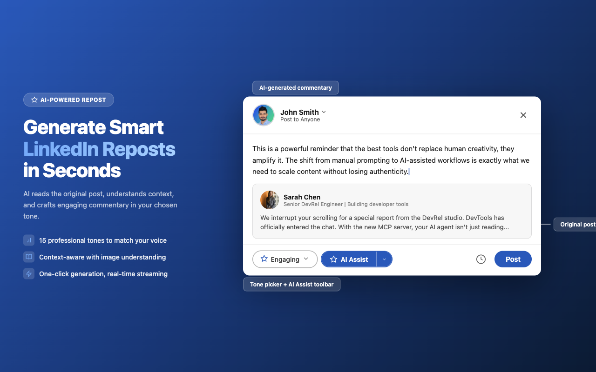
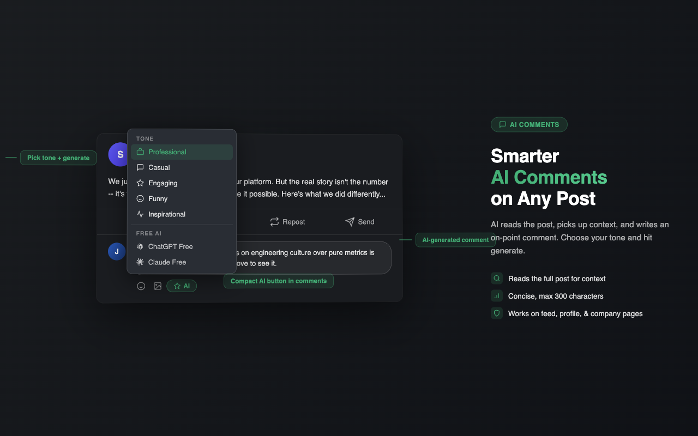
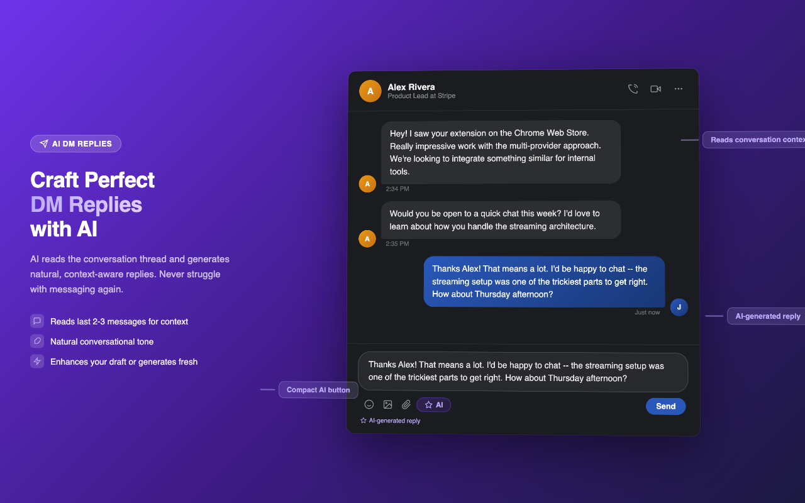
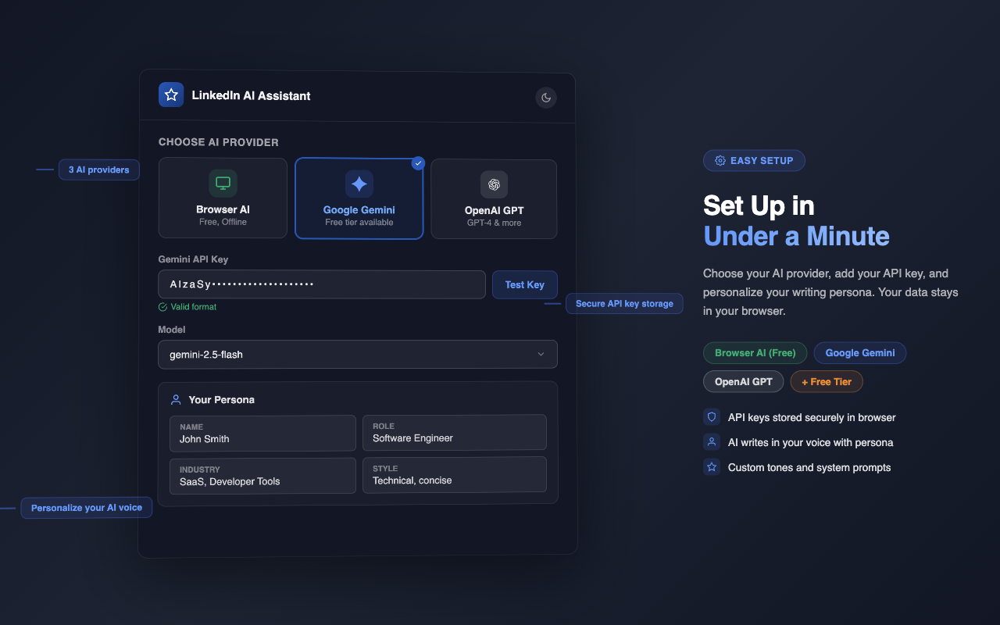
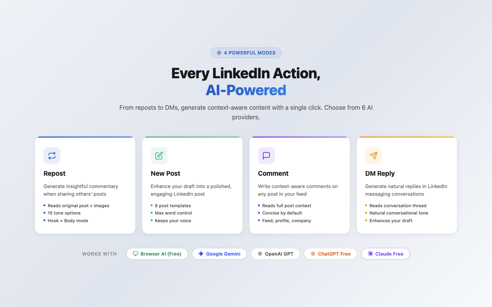

# LinkedIn AI Repost - Documentation

This repository contains public documentation and legal information for the **LinkedIn AI Repost with ChatGPT & Gemini** Chrome Extension.

## Screenshots

  
  
<em>Repost Mode - Generate AI-powered commentary when sharing posts</em>

  
  
<em>Comment Mode - Generate context-aware comments on posts</em>

  
  
<em>DM Reply Mode - Generate conversation-aware replies in messaging</em>

  
  
<em>Settings - Configure AI providers, tones, and preferences</em>

  
  
<em>All Modes - Overview of available AI writing modes</em>

## Legal Documents

- **[Privacy Policy](PRIVACY_POLICY.md)** - How we handle your data (spoiler: we don't collect any)
- **[Terms of Service](TERMS_OF_SERVICE.md)** - Terms and conditions for using the extension

## Quick Links

- **Chrome Web Store**: [LinkedIn AI Repost with ChatGPT & Gemini](https://chromewebstore.google.com/detail/linkedin-ai-repost-with-c/khfikcfcjamhalghcbgnhldaenlccfpb)
- **Source Code**: [GitHub](https://github.com/yogendrasinghx/linkedin_ai_repost)
- **Developer**: [Yogendra Singh](https://yogendrasingh.in)

## About the Extension

LinkedIn AI Repost with ChatGPT & Gemini is a privacy-first Chrome extension that helps you create engaging LinkedIn content using AI. It supports:

- **Repost Mode**: Generate commentary when sharing someone else's post (with image-aware AI)
- **New Post Mode**: Rephrase and enhance your own draft content
- **Comment Mode**: Generate context-aware comments on feed, company, profile, and activity post pages
- **DM Reply Mode**: Generate conversation-aware replies in LinkedIn messaging
- **Three AI Providers**: Browser AI (free, on-device), Google Gemini, and OpenAI GPT
- **Free Tier**: Use ChatGPT, Claude, or Gemini web interfaces without API keys

### Key Features

- **Browser AI**: Free, on-device AI with Gemini Nano - no API key, works offline
- **Image-Aware AI**: Extracts post images for richer, visually-aware commentary
- **15 Tones**: Professional, Casual, Witty, Inspirational, Custom, and more
- **Max Word Count**: Control the length of generated content
- **Privacy-First**: Your API keys stay in your browser, no data collection
- **Dark Mode**: Automatic theme detection with manual toggle
- **BYOK Model**: Bring Your Own Key - you control costs

## Privacy & Security

We take your privacy seriously:

- **No data collection** - We don't collect, store, or transmit any personal data
- **Local storage only** - API keys stored in Chrome's encrypted storage
- **Direct API calls** - Your browser communicates directly with AI providers
- **On-device AI** - Browser AI processes everything locally, data never leaves your browser
- **No tracking** - No analytics, telemetry, or usage monitoring

Read our full [Privacy Policy](PRIVACY_POLICY.md) for details.

## Contact

For questions, concerns, or support:

- **Developer Portfolio**: [https://yogendrasingh.in](https://yogendrasingh.in)
- **GitHub Issues**: [https://github.com/yogendrasinghx/linkedin_ai_repost/issues](https://github.com/yogendrasinghx/linkedin_ai_repost/issues)

## License

The extension is proprietary software. All rights reserved.

This documentation repository is provided for transparency and Chrome Web Store compliance.

---

**Last Updated**: February 24, 2026
